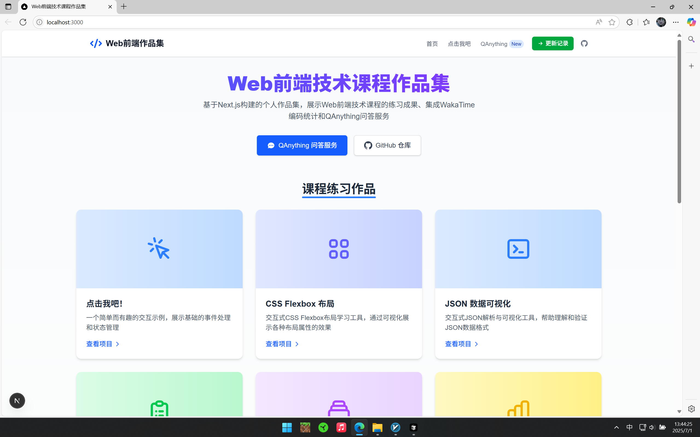
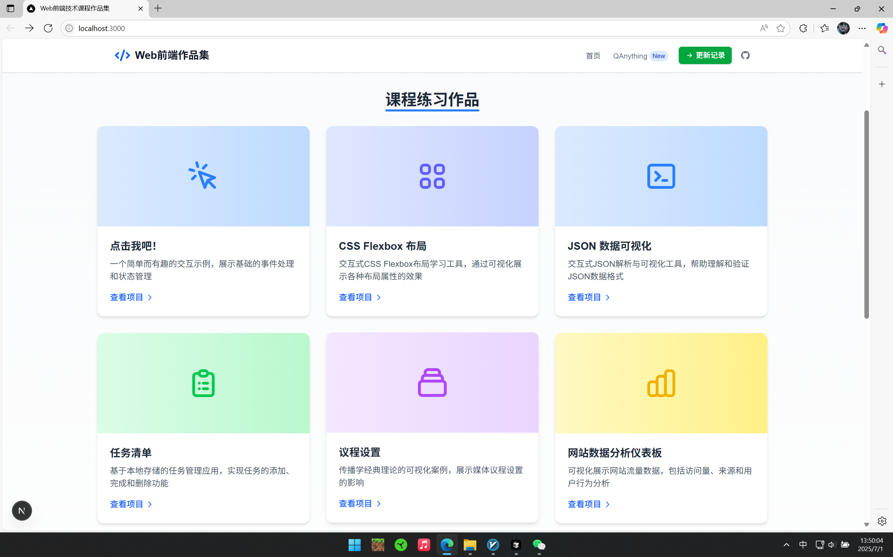
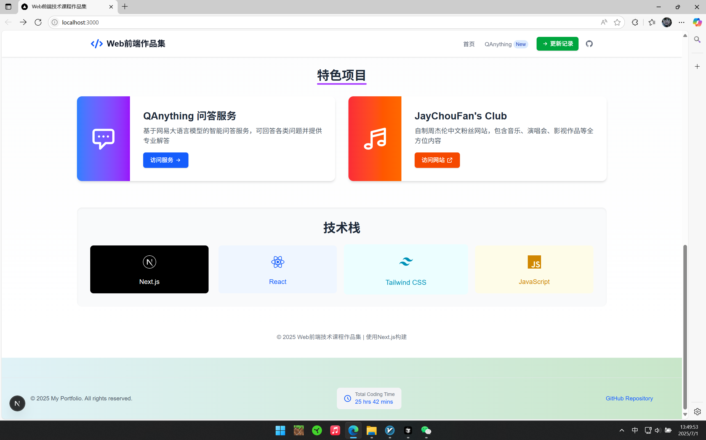
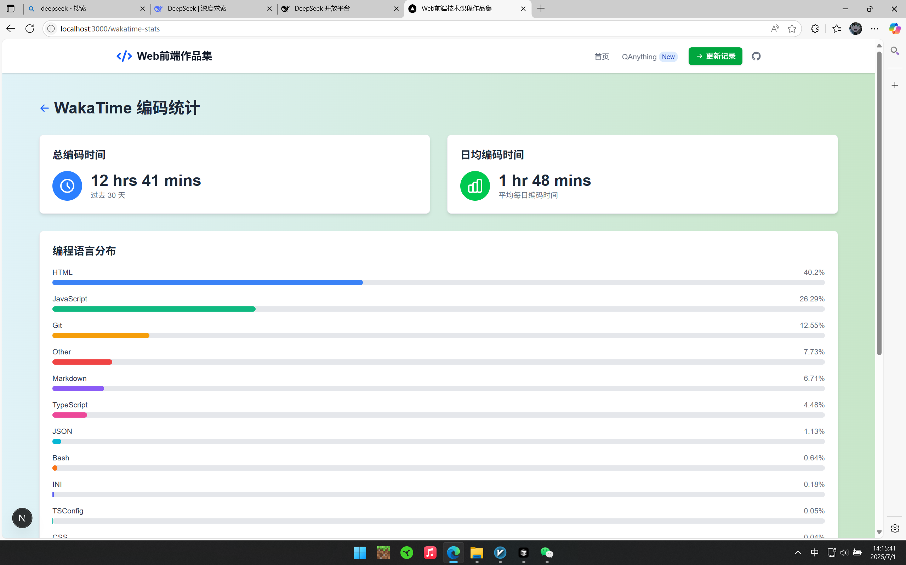
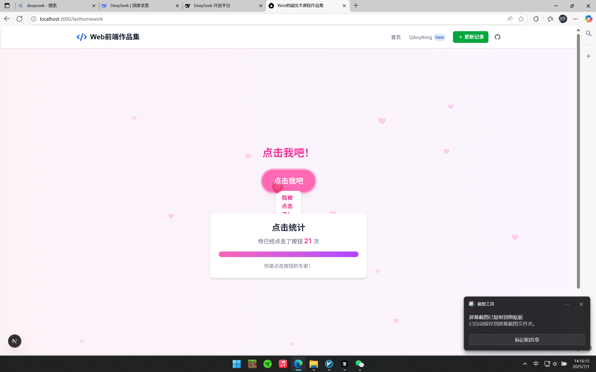
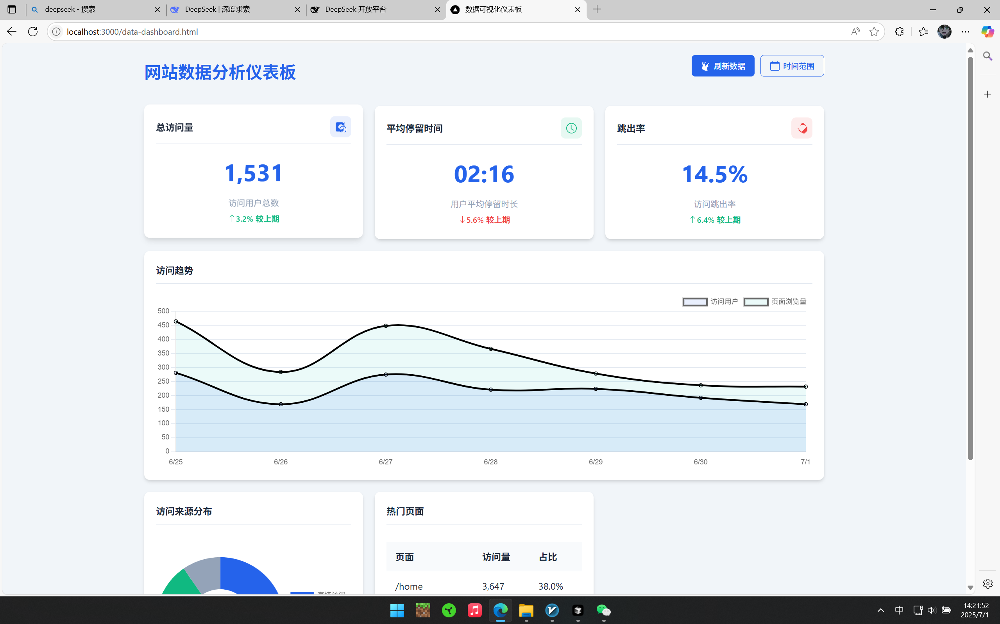
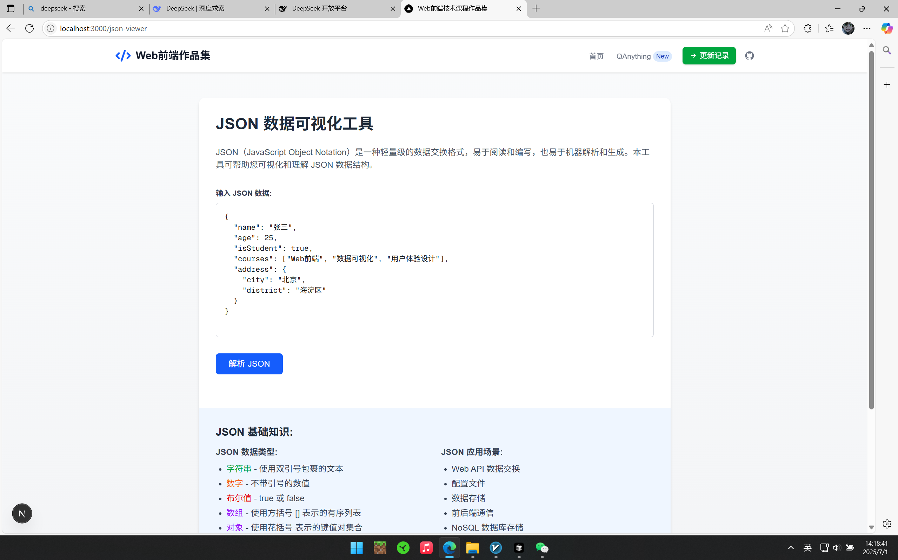
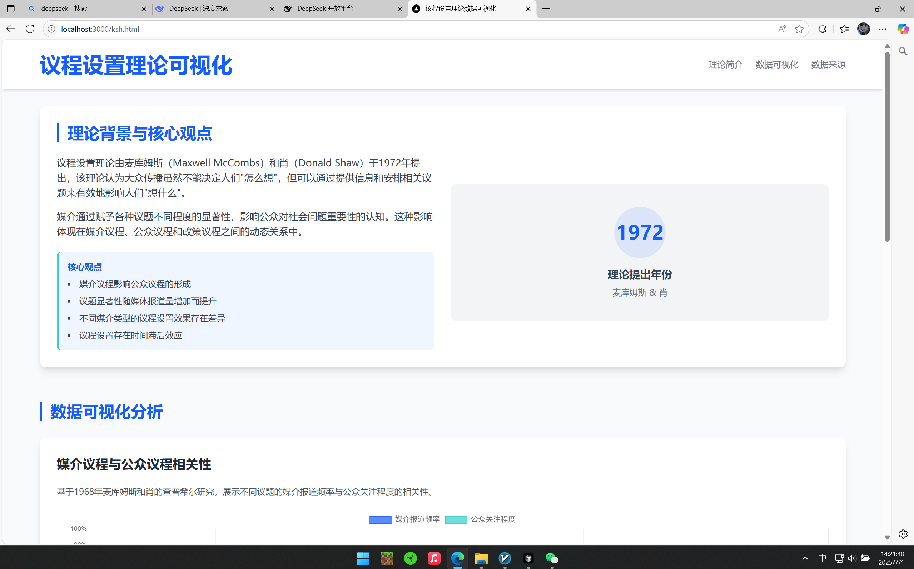
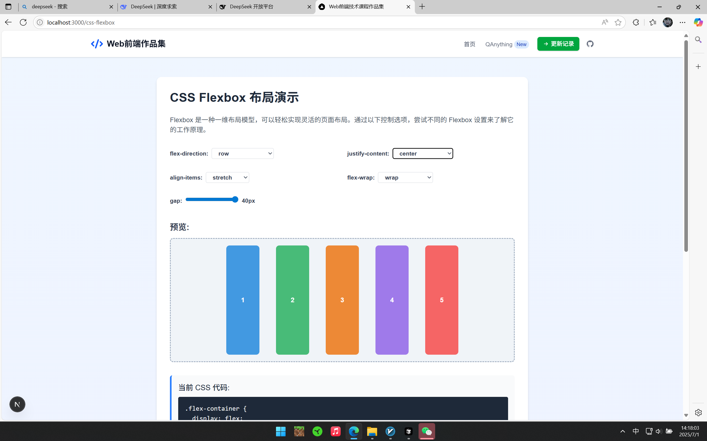
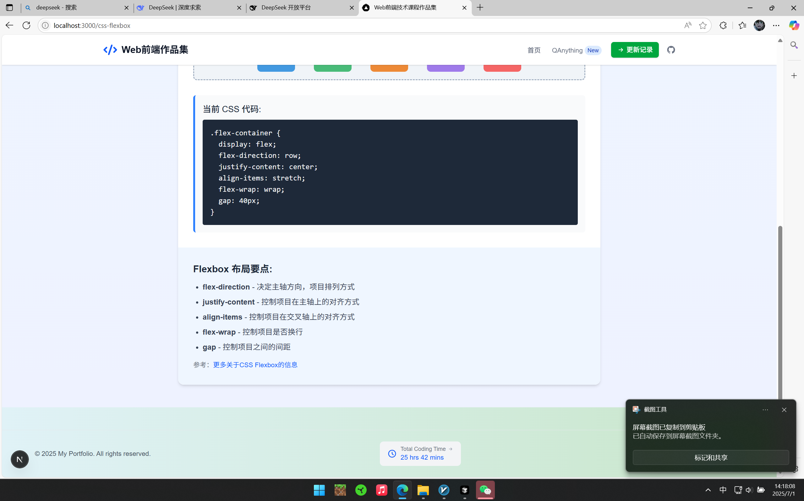

# Web前端技术课程作业集

这是一个整合了Web前端技术课程所有作业的仓库，主要包含一个基于Next.js构建的个人作品集网站（`my-portfolio`）和一个纯HTML/CSS/JavaScript实现的周杰伦歌迷站（`jaychou`）。

## 项目概览

### 1. 个人作品集 (`my-portfolio`)

这是一个基于 Next.js 构建的个人作品集网站，用于展示 Web 前端技术课程的练习成果、集成 WakaTime 编码统计和 QAnything 问答服务。旨在通过实际项目，巩固所学知识，并探索前端开发的更多可能性。

#### 功能模块

- **课程作业整合**：将本学期的所有课程练习整合到此 Next.js 应用中，每个练习都被创建为一个独立的页面，并通过路由进行访问。包括：
  - **点击我吧！**：一个简单的点击按钮交互示例。
  - **任务清单**：一个基于本地存储的任务管理应用。
  - **议程设置**：传播学经典理论的可视化案例。
  - **网站模拟数据分析仪表板**：展示网站流量数据的模拟仪表板。
  - **JayChouFan's Club**：自制周杰伦中文粉丝网（此项目本身也是一个独立的作业，在此处作为链接集成）。
  - **CSS Flexbox布局演示**：交互式Flexbox布局学习工具，可实时调整各种Flexbox属性并查看效果。
  - **JSON数据可视化工具**：可将JSON文本解析并以树形结构可视化展示，支持各种数据类型的高亮显示。
  - **QAnything 问答服务**：基于大语言模型的智能问答服务，支持iframe嵌入和API调用两种方式。
- **QAnything 集成**：通过两种方式集成问答服务：
  - **iframe嵌入方式**：在 `/qanything` 路由中嵌入问答服务界面，提供完整的用户体验。
  - **API调用方式**：通过 `/api/qanything` 路由提供API接口，支持多轮对话和自定义参数。
  - **嵌入示例页面**：在 `/qanything/embed-example` 路由中提供了两种集成方式的代码示例和预览。
- **WakaTime API 集成**：在页脚部分集成了 WakaTime API，展示个人的编码活动和总编码时长。API Key 通过环境变量 `.env.local` 存储，并通过 Next.js API 路由 (`/api/wakatime`) 作为代理，确保了 API Key 的安全性和数据的私密性。

#### 技术栈

- Next.js (React)
- Tailwind CSS
- JavaScript
- HTML/CSS

#### 项目结构

```
my-portfolio/
├── .env.local (可选，用于WakaTime API Key)
├── public/             # 存放静态资源和纯HTML作业页面
│   ├── data-dashboard.html
│   ├── ksh.html
│   ├── task-manager.html
│   ├── time.html
│   ├── screenshots/    # 项目截图
│   └── ...
├── src/
│   ├── app/            # 所有页面和路由 (包括API路由)
│   │   ├── api/        # API 路由，例如 wakatime 和 qanything
│   │   ├── css-flexbox/ # CSS Flexbox布局演示页面
│   │   ├── jay/        # "周杰伦歌迷站"练习页面
│   │   ├── json-viewer/ # JSON数据可视化工具页面
│   │   ├── lasthomework/ # "点击我吧！"练习页面
│   │   ├── qanything/  # "QAnything 问答服务"页面及嵌入示例
│   │   ├── layout.js   # 全局布局文件
│   │   └── page.jsx    # 项目首页
│   └── components/     # 可重用 React 组件
│       └── Footer.jsx
├── package.json        # 项目依赖和脚本
└── ...
```

#### 新增作业页面

##### CSS Flexbox布局演示

这是一个交互式的CSS Flexbox布局学习工具，用户可以通过界面控制选项实时调整各种Flexbox属性并立即查看效果。主要特点：

- **实时预览**：调整参数后立即显示布局效果
- **可视化控制**：提供直观的控制界面，包括下拉菜单和滑块
- **代码生成**：自动生成对应的CSS代码
- **教学说明**：包含Flexbox布局的关键概念解释
- **响应式设计**：适配不同屏幕尺寸

路由：`/css-flexbox`

##### JSON数据可视化工具

这是一个用于解析和可视化JSON数据的工具，可以将JSON文本解析并以树形结构直观地展示。主要特点：

- **语法高亮**：不同数据类型使用不同颜色高亮显示
- **树形结构**：以缩进和层次清晰展示JSON的嵌套结构
- **错误处理**：提供友好的JSON解析错误提示
- **示例数据**：预设示例数据方便用户快速开始
- **JSON基础知识**：包含JSON数据类型和应用场景的简要说明

路由：`/json-viewer`

#### QAnything 集成实现细节

QAnything 服务的集成采用了两种方式：iframe嵌入和API调用，主要实现细节如下：

##### iframe嵌入方式

- **简单可靠**：通过iframe直接嵌入问答服务界面，确保功能的稳定性和兼容性
- **全屏体验**：提供完整的问答服务体验，包括所有原生功能
- **加载状态**：添加加载状态指示器，提升用户体验
- **错误处理**：当iframe加载失败时提供备选方案
- **响应式设计**：适配不同屏幕尺寸

##### API调用方式

- **自定义接口**：创建了 `/api/qanything` API路由，作为代理转发请求到实际的大语言模型API
- **多轮对话**：支持保存对话历史，实现连续多轮对话
- **参数自定义**：支持调整温度(temperature)和最大输出长度(max_tokens)等参数
- **错误处理**：当API调用失败时提供模拟响应作为备份
- **安全性**：在服务器端处理API调用，避免在客户端暴露API密钥

##### 嵌入示例页面

专门创建了一个示例页面，展示两种集成方式的代码和效果预览，方便开发者参考：

- **代码示例**：提供完整的iframe嵌入代码和API调用代码
- **复制功能**：一键复制代码到剪贴板
- **预览效果**：展示iframe嵌入的实际效果
- **注意事项**：提供API调用的最佳实践和注意事项
- **自定义指南**：关于如何根据自己的网站风格自定义外观的建议

路由：`/qanything/embed-example`

#### WakaTime API 集成方法

WakaTime API 的集成采用了以下方法：

1. **API Key 安全管理**：使用 `.env.local` 文件存储 API Key，该文件不会被提交到版本控制系统。
2. **服务器端代理**：创建了一个 Next.js API 路由 (`/api/wakatime`) 作为代理，避免在客户端暴露 API Key。
3. **错误处理与备用数据**：实现了完善的错误处理机制，当 API Key 未配置或请求失败时，提供模拟数据，确保用户界面的一致性。
4. **缓存策略**：使用 Next.js 的 `revalidate` 功能，减少对 WakaTime API 的请求频率，提高应用性能。
5. **UI 展示**：在页脚组件中展示编码时长数据，使其在整个应用中可见。

#### 运行指南

1.  克隆本项目到本地：
    ```bash
    git clone https://github.com/xianglun515/webhomework-p231014798.git
    cd webhomework-p231014798/my-portfolio
    ```
2.  在项目根目录下创建 `.env.local` 文件，并添加您的 WakaTime API Key（可选，如果不需要 WakaTime 功能可跳过）：
    ```
    NEXT_PUBLIC_WAKATIME_API_KEY=your_wakatime_api_key
    ```
3.  安装项目依赖：
    ```bash
    npm install
    ```
4.  启动开发服务器：
    ```bash
    npm run dev
    ```
5.  在浏览器中打开 `http://localhost:3000` 查看。

**注意**：首次运行 `npm run dev` 时，Next.js 可能需要一些时间来编译和优化项目。请耐心等待，直到控制台显示"ready - started server on 0.0.0.0:3000, url: http://localhost:3000"信息。

### 2. 周杰伦歌迷站 (`jaychou`)

这是一个为周杰伦粉丝设计的网页，包含了他的个人简介、音乐专辑、演唱会信息、影视作品以及最新的资讯。粉丝还可以加入粉丝俱乐部，获取专属权益。

#### 功能模块

- **简介**：介绍周杰伦的基本信息、职业生涯和重要成就。
- **音乐专辑**：列出周杰伦的经典音乐专辑，并提供部分专辑的简介。
- **演唱会**：展示周杰伦演唱会的现场照片。
- **影视作品**：介绍周杰伦参演或导演的影视作品。
- **最新资讯**：提供周杰伦的最新动态和新闻。
- **粉丝俱乐部**：粉丝可以通过填写表单加入俱乐部，享受会员专属权益，并关注官方社交媒体。
- **GitHub 数据同步**：页面底部显示项目在 GitHub 上的最后更新时间和提交次数。

#### 技术栈

- HTML
- CSS
- JavaScript

#### 项目结构

```
jaychou/
├── index.html         # 主页面文件
├── README.md          # 项目说明文件
├── jay picture.jpg    # 周杰伦肖像图片
├── ych1.jpg           # 演唱会图片1
├── ych2.jpg           # 演唱会图片2
├── secret.png         # 电影《不能说的秘密》图片1
├── secret2.png        # 电影《不能说的秘密》图片2
├── d1.png             # 电影《头文字D》图片1
└── d2.png             # 电影《头文字D》图片2
```

#### 运行指南

1. 克隆本仓库到本地：
   ```bash
   git clone https://github.com/xianglun515/webhomework-p231014798.git
   ```
2. 进入 `jaychou` 目录：
   ```bash
   cd webhomework-p231014798/jaychou
   ```
3. 使用任何支持 HTML 的浏览器直接打开 `index.html` 文件即可。
   ```
   open index.html
   ```

## 运行截图

### 个人作品集网站 (`my-portfolio`)

#### 首页展示
- **首页顶部区域**：展示项目标题、导航菜单和项目简介
  
  
- **首页项目展示区**：展示各个课程练习项目的卡片和链接
  
  
- **首页底部区域**：展示页脚信息和WakaTime编码统计
  

#### QAnything问答服务
- **QAnything API调用方式**：展示通过API方式集成的问答服务界面
  
  
- **QAnything iframe嵌入方式**：展示通过iframe方式集成的问答服务界面
  

#### WakaTime编码统计
- **页脚WakaTime统计展示**：在页脚显示的编码时间统计信息
  
  
- **WakaTime详细统计页面**：展示详细的编码时间分布和项目统计
  

#### 课程练习项目
- **"点击我吧"交互练习**：简单的按钮点击交互示例
  
  
- **网站数据分析仪表盘**：展示网站流量和用户数据的模拟仪表盘
  
  
- **任务管理器应用**：基于本地存储的任务清单管理工具
  
  
- **JSON数据可视化工具**：将JSON文本解析并以树形结构展示
  
  
- **议程设置可视化**：传播学经典理论的可视化案例
  
  
- **CSS Flexbox布局演示**：交互式Flexbox布局学习工具
  
  

### 周杰伦歌迷网站 (`jaychou`)

- **歌迷俱乐部页面**：展示周杰伦歌迷俱乐部
  