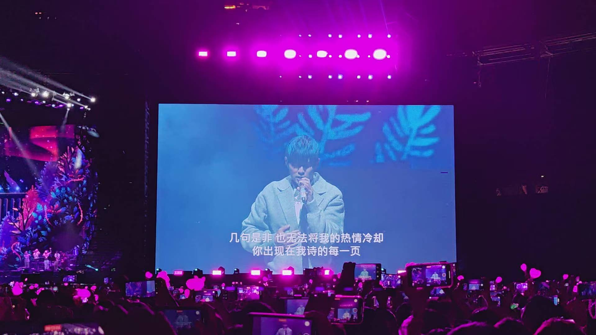
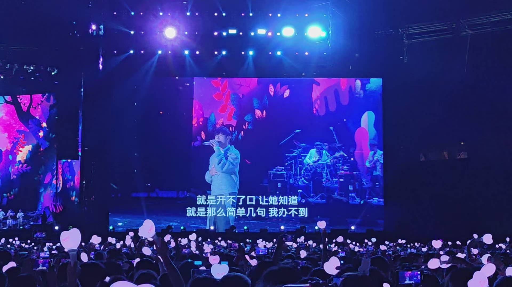

# 周杰伦歌迷站

这是一个为周杰伦粉丝设计的网页，包含了他的个人简介、音乐专辑、演唱会信息、影视作品以及最新的资讯。粉丝还可以加入粉丝俱乐部，获取专属权益。

## 功能模块

- **简介**：介绍周杰伦的基本信息、职业生涯和重要成就。
- **音乐专辑**：列出周杰伦的经典音乐专辑，并提供部分专辑的简介。
- **演唱会**：展示周杰伦演唱会的现场照片。
- **影视作品**：介绍周杰伦参演或导演的影视作品。
- **最新资讯**：提供周杰伦的最新动态和新闻。
- **粉丝俱乐部**：粉丝可以通过填写表单加入俱乐部，享受会员专属权益，并关注官方社交媒体。
- **GitHub 数据同步**：页面底部显示项目在 GitHub 上的最后更新时间和提交次数。

## 如何运行

1. 克隆本仓库到本地：
   ```bash
   git clone https://github.com/xianglun515/webhomework-p231014798.git
   ```
2. 进入 `jaychou` 目录：
   ```bash
   cd webhomework-p231014798/jaychou
   ```
3. 使用任何支持 HTML 的浏览器直接打开 `index.html` 文件即可。
   ```
   open index.html
   ```

## 技术栈

- HTML
- CSS
- JavaScript

## 项目结构

```
jaychou/
├── index.html         # 主页面文件
├── README.md          # 项目说明文件
├── jay picture.jpg    # 周杰伦肖像图片
├── ych1.jpg           # 演唱会图片1
├── ych2.jpg           # 演唱会图片2
├── secret.png         # 电影《不能说的秘密》图片1
├── secret2.png        # 电影《不能说的秘密》图片2
├── d1.png             # 电影《头文字D》图片1
└── d2.png             # 电影《头文字D》图片2
```

## 运行截图

### 1. 网站首页与简介
- **周杰伦个人简介**：展示艺人基本信息和主要成就
  

### 2. 音乐与演唱会
- **演唱会现场照片**：展示周杰伦演唱会的精彩瞬间
  
  

### 3. 影视作品展示
- **电影《不能说的秘密》**：周杰伦自导自演的音乐爱情电影
  
  
  
- **电影《头文字D》**：周杰伦主演的赛车题材电影
  
  

### 4. 粉丝俱乐部
- **周杰伦歌迷俱乐部**：展示粉丝俱乐部页面和会员权益
  