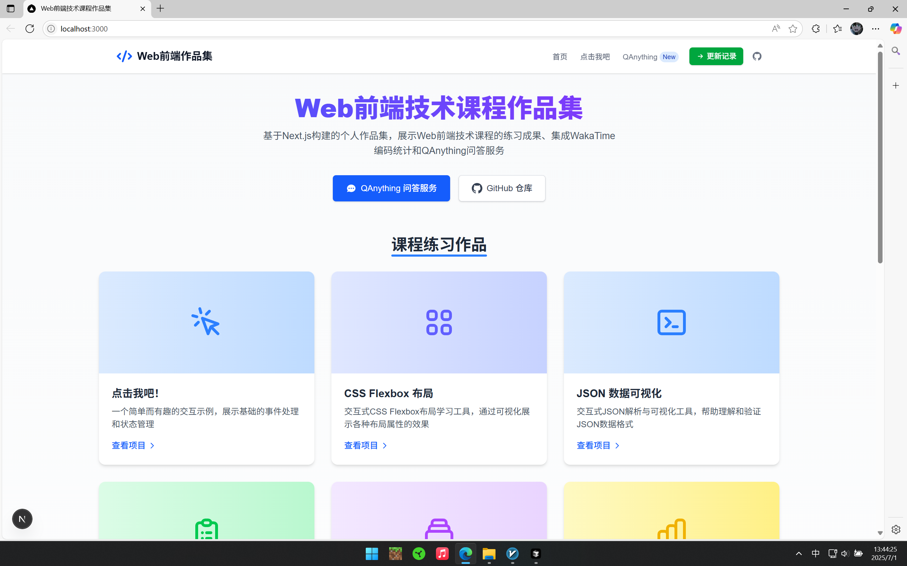
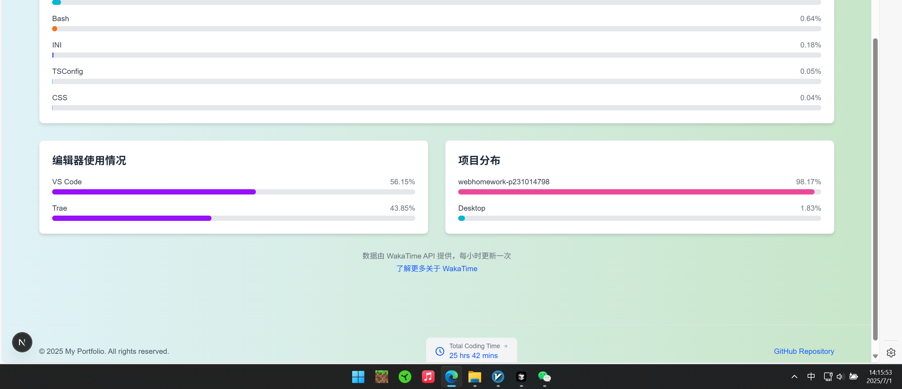
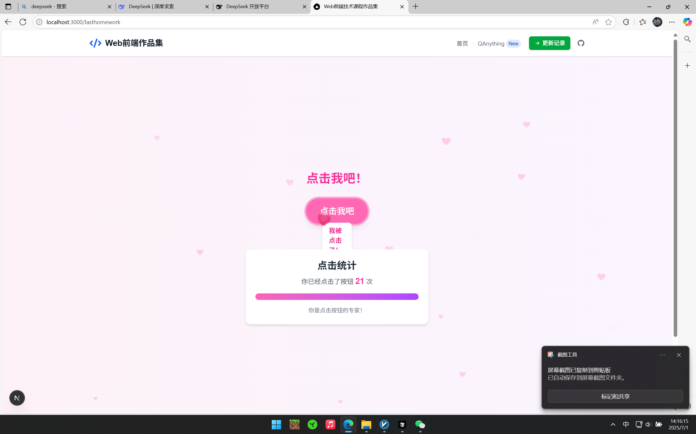
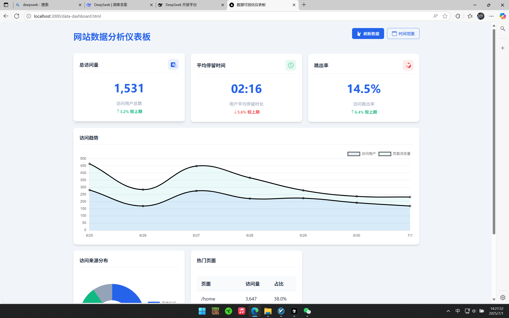
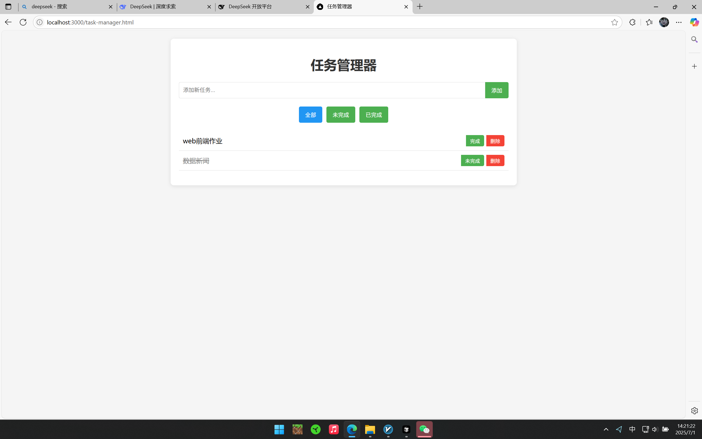
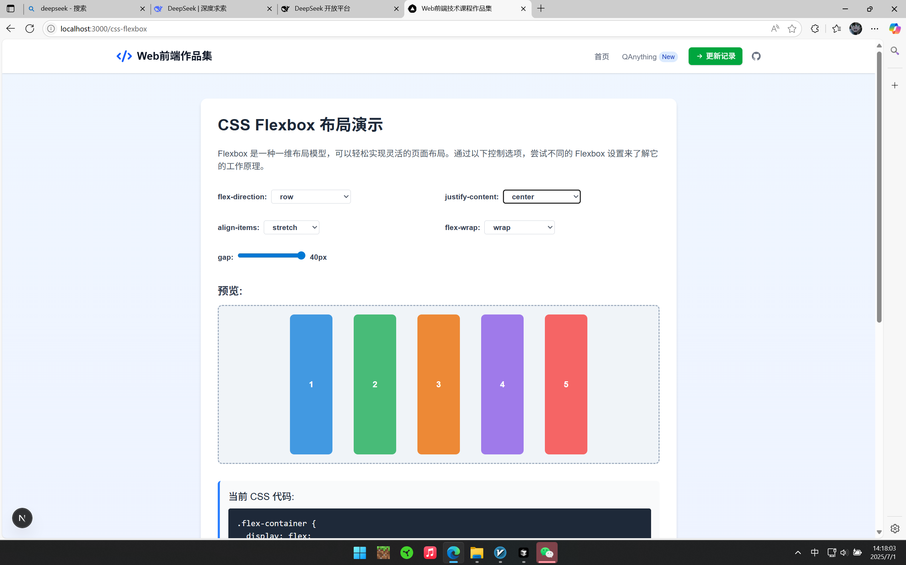
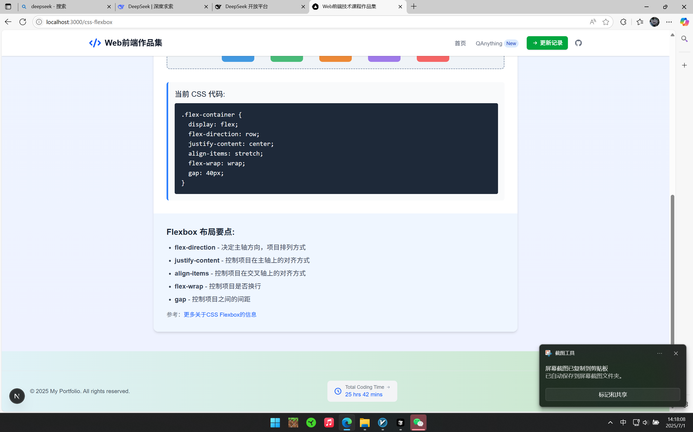

# Web前端技术课程作品集

这是一个基于 Next.js 构建的个人作品集网站，用于展示 Web 前端技术课程的练习成果、集成 WakaTime 编码统计和 QAnything 问答服务。

## 项目概览

本项目旨在通过实际项目，巩固所学知识，并探索前端开发的更多可能性。主要功能包括：

### 功能模块

- **课程作业整合**：将本学期的所有课程练习整合到此 Next.js 应用中，每个练习都被创建为一个独立的页面，并通过路由进行访问。包括：
  - **点击我吧！**：一个简单的点击按钮交互示例。
  - **任务清单**：一个基于本地存储的任务管理应用。
  - **议程设置**：传播学经典理论的可视化案例。
  - **网站数据分析仪表板**：展示网站流量数据的可视化仪表板。
  - **JayChouFan's Club**：自制周杰伦中文粉丝网（此项目本身也是一个独立的作业，在此处作为链接集成）。
  - **QAnything 问答服务**：基于网易大语言模型的智能问答服务。
- **QAnything 集成**：通过 iframe 直接嵌入 QAnything 问答服务到应用中，用户可以通过访问 `/qanything` 路由使用此服务，界面经过精心设计，包含加载状态、错误处理和使用指南。
- **WakaTime API 集成**：在页脚部分集成了 WakaTime API，展示个人的编码活动和总编码时长。API Key 通过环境变量 `.env.local` 存储，并通过 Next.js API 路由 (`/api/wakatime`) 作为代理，确保了 API Key 的安全性和数据的私密性。

### 技术栈

- **Next.js 14**：使用最新的 React 框架，支持服务端渲染和静态生成
- **React 18**：采用函数式组件和 Hooks 进行开发
- **Tailwind CSS**：实现响应式设计和现代化 UI
- **JavaScript ES6+**：使用现代 JavaScript 特性
- **HTML5/CSS3**：遵循最新的 Web 标准

## 项目结构

```
my-portfolio/
├── .env.local (用于WakaTime API Key)
├── public/             # 存放静态资源和纯HTML作业页面
│   ├── data-dashboard.html
│   ├── ksh.html
│   ├── task-manager.html
│   ├── time.html
│   ├── screenshots/    # 存放项目截图
│   └── ...
├── src/
│   ├── app/            # 所有页面和路由 (包括API路由)
│   │   ├── api/        # API 路由，例如 wakatime 代理
│   │   ├── jay/        # "周杰伦歌迷站"练习页面
│   │   ├── lasthomework/ # "点击我吧！"练习页面
│   │   ├── qanything/  # "QAnything 问答服务"页面
│   │   ├── layout.js   # 全局布局文件
│   │   └── page.jsx    # 项目首页
│   └── components/     # 可重用 React 组件
│       └── Footer.jsx
├── package.json        # 项目依赖和脚本
└── ...
```

## QAnything 集成实现细节

QAnything 服务的集成采用了 iframe 直接嵌入方式，主要考虑以下因素：

1. **简单可靠**：直接嵌入 iframe 是最简单、最可靠的集成方式，确保功能的稳定性和兼容性。
2. **全屏体验**：通过全屏 iframe 提供完整的 QAnything 体验，用户可以在应用内使用所有 QAnything 功能。
3. **用户友好**：添加了加载状态指示器、错误处理和使用指南，提升用户体验。
4. **响应式设计**：iframe 容器采用响应式设计，在不同设备上都能提供良好的使用体验。
5. **备选方案**：为防止嵌入服务加载失败，提供了直接访问 QAnything 官方页面的链接。

代码实现（`src/app/qanything/page.jsx`）：

```jsx
'use client';

import React, { useState, useEffect } from 'react';

export default function QAnythingPage() {
  const [isLoading, setIsLoading] = useState(true);
  const [loadError, setLoadError] = useState(false);
  const [showTips, setShowTips] = useState(false);

  // 模拟iframe加载状态
  useEffect(() => {
    const timer = setTimeout(() => {
      setIsLoading(false);
    }, 2500);
    
    return () => clearTimeout(timer);
  }, []);

  // 处理iframe加载事件
  const handleIframeLoad = () => {
    setIsLoading(false);
    setLoadError(false);
  };

  // 处理iframe加载错误
  const handleIframeError = () => {
    setIsLoading(false);
    setLoadError(true);
  };

  return (
    <div className="min-h-screen py-8 px-4 sm:px-6 lg:px-8 bg-gradient-to-b from-gray-50 to-white">
      <header className="text-center mb-10">
        <h1 className="text-5xl font-extrabold text-transparent bg-clip-text bg-gradient-to-r from-blue-600 to-purple-600 mb-4">QAnything 智能问答</h1>
        <p className="mt-2 text-lg text-gray-600 max-w-2xl mx-auto">基于网易大语言模型的智能问答服务，可回答各类问题并提供专业解答</p>
      </header>
      
      <div className="max-w-6xl mx-auto">
        <div className="bg-white rounded-xl shadow-lg overflow-hidden relative">
          {isLoading && (
            <div className="absolute inset-0 flex items-center justify-center bg-gray-100 bg-opacity-80 z-10">
              <div className="flex flex-col items-center">
                <div className="animate-spin rounded-full h-16 w-16 border-t-2 border-b-2 border-blue-500 mb-4"></div>
                <p className="text-gray-700 font-medium">正在加载 QAnything 服务...</p>
              </div>
            </div>
          )}
          
          {loadError ? (
            <div className="p-8 text-center">
              <svg xmlns="http://www.w3.org/2000/svg" className="h-16 w-16 text-red-500 mx-auto mb-4" fill="none" viewBox="0 0 24 24" stroke="currentColor">
                <path strokeLinecap="round" strokeLinejoin="round" strokeWidth={2} d="M12 9v2m0 4h.01m-6.938 4h13.856c1.54 0 2.502-1.667 1.732-3L13.732 4c-.77-1.333-2.694-1.333-3.464 0L3.34 16c-.77 1.333.192 3 1.732 3z" />
              </svg>
              <h3 className="text-xl font-bold text-gray-800 mb-2">加载失败</h3>
              <p className="text-gray-600 mb-4">无法加载 QAnything 服务，请检查您的网络连接或稍后再试</p>
              <a 
                href="https://ai.youdao.com/saas/qanything/#/bots/5E4C86E64E74407F/share" 
                target="_blank" 
                rel="noopener noreferrer"
                className="inline-flex items-center px-4 py-2 border border-transparent text-sm font-medium rounded-md shadow-sm text-white bg-blue-600 hover:bg-blue-700 transition-colors"
              >
                直接访问 QAnything
              </a>
            </div>
          ) : (
            <iframe
              src="https://ai.youdao.com/saas/qanything/#/bots/5E4C86E64E74407F/share"
              className="w-full h-[75vh] border-none"
              title="QAnything"
              allow="microphone"
              onLoad={handleIframeLoad}
              onError={handleIframeError}
            ></iframe>
          )}
        </div>
        
        <div className="mt-8">
          <div className="bg-blue-50 border-l-4 border-blue-500 p-4 rounded-md">
            <div className="flex">
              <div className="flex-shrink-0">
                <svg className="h-5 w-5 text-blue-500" xmlns="http://www.w3.org/2000/svg" viewBox="0 0 20 20" fill="currentColor">
                  <path fillRule="evenodd" d="M18 10a8 8 0 11-16 0 8 8 0 0116 0zm-7-4a1 1 0 11-2 0 1 1 0 012 0zM9 9a1 1 0 000 2v3a1 1 0 001 1h1a1 1 0 100-2v-3a1 1 0 00-1-1H9z" clipRule="evenodd" />
                </svg>
              </div>
              <div className="ml-3">
                <h3 className="text-sm font-medium text-blue-800">关于 QAnything</h3>
                <div className="mt-2 text-sm text-blue-700">
                  <p>QAnything 是网易有道推出的智能问答服务，基于大语言模型技术，可以回答各类问题。</p>
                </div>
              </div>
            </div>
          </div>
          
          <div className="mt-6">
            <button
              onClick={() => setShowTips(!showTips)}
              className="flex items-center text-gray-700 hover:text-gray-900 transition-colors"
            >
              <svg xmlns="http://www.w3.org/2000/svg" className={`h-5 w-5 mr-1 transition-transform ${showTips ? 'rotate-90' : ''}`} fill="none" viewBox="0 0 24 24" stroke="currentColor">
                <path strokeLinecap="round" strokeLinejoin="round" strokeWidth={2} d="M9 5l7 7-7 7" />
              </svg>
              <span className="font-medium">使用技巧</span>
            </button>
            
            {showTips && (
              <div className="mt-3 pl-6 text-gray-600 space-y-2 text-sm">
                <p>• 提问时尽量描述清楚您的问题，提供足够的上下文</p>
                <p>• 可以询问学术知识、编程问题、生活常识等多领域问题</p>
                <p>• 如果回答不满意，可以尝试重新表述您的问题</p>
                <p>• 支持连续对话，可以基于之前的回答继续提问</p>
                <p>• 如遇加载问题，可以尝试刷新页面或直接访问QAnything官方链接</p>
              </div>
            )}
          </div>
        </div>
      </div>
    </div>
  );
}
```

## WakaTime API 集成方法

WakaTime API 的集成采用了以下方法：

1. **API Key 安全管理**：使用 `.env.local` 文件存储 API Key，该文件不会被提交到版本控制系统。
2. **服务器端代理**：创建了一个 Next.js API 路由 (`/api/wakatime`) 作为代理，避免在客户端暴露 API Key。
3. **错误处理与备用数据**：实现了完善的错误处理机制，当 API Key 未配置或请求失败时，提供模拟数据，确保用户界面的一致性。
4. **缓存策略**：使用 Next.js 的 `revalidate` 功能，减少对 WakaTime API 的请求频率，提高应用性能。
5. **UI 展示**：在页脚组件中展示编码时长数据，使其在整个应用中可见。

代码实现（API 路由 `src/app/api/wakatime/route.js`）：

```javascript
import { NextResponse } from 'next/server';

export async function GET(request) {
  const apiKey = process.env.NEXT_PUBLIC_WAKATIME_API_KEY;

  // 如果没有配置API Key，返回模拟数据
  if (!apiKey) {
    console.log('WakaTime API Key not configured, returning mock data');
    return NextResponse.json({
      data: {
        text: '23 hrs 45 mins',
        total_seconds: 85500,
        is_mock_data: true
      }
    });
  }

  try {
    const encodedApiKey = btoa(apiKey);
    const url = 'https://wakatime.com/api/v1/users/current/all_time_since_today';

    const response = await fetch(url, {
      headers: {
        Authorization: `Basic ${encodedApiKey}`,
      },
      cache: 'no-store', // 禁用缓存，确保获取最新数据
    });

    if (!response.ok) {
      const errorBody = await response.text();
      console.error('WakaTime API returned an error:', {
        status: response.status,
        statusText: response.statusText,
        body: errorBody,
      });
      
      // 返回模拟数据，但标记为错误状态
      return NextResponse.json({
        data: {
          text: '10 hrs 30 mins',
          total_seconds: 37800,
          is_mock_data: true,
          error_status: response.status
        }
      });
    }

    const data = await response.json();
    return NextResponse.json(data);

  } catch (error) {
    console.error('An unexpected error occurred in the WakaTime API route:', error);
    
    // 返回模拟数据，但标记为错误状态
    return NextResponse.json({
      data: {
        text: '10 hrs 30 mins',
        total_seconds: 37800,
        is_mock_data: true,
        error_message: error.message
      }
    });
  }
}
```

客户端实现（`src/components/Footer.jsx`）：

```jsx
'use client';

import { useState, useEffect } from 'react';

export default function Footer() {
  const [wakaTimeStats, setWakaTimeStats] = useState(null);
  const [loading, setLoading] = useState(true);
  const [error, setError] = useState(null);

  useEffect(() => {
    async function fetchWakaTimeStats() {
      try {
        setLoading(true);
        const response = await fetch('/api/wakatime');
        const data = await response.json();
        
        if (data.error) {
          throw new Error(data.error);
        }
        
        setWakaTimeStats(data.data);
        setError(null);
      } catch (err) {
        console.error('Error fetching WakaTime stats:', err);
        setError('Could not load coding stats');
      } finally {
        setLoading(false);
      }
    }

    fetchWakaTimeStats();
  }, []);

  return (
    <footer className="bg-white border-t border-gray-200 py-8">
      <div className="max-w-7xl mx-auto px-4 sm:px-6 lg:px-8">
        <div className="flex flex-col md:flex-row justify-between items-center">
          <div className="mb-4 md:mb-0">
            <p className="text-sm text-gray-500">
              © 2024 Web前端技术课程作品集 | 使用 Next.js 构建
            </p>
          </div>
          <div className="flex items-center">
            <div className="mr-4 text-sm text-gray-500">
              <span className="font-medium">累计编码时长：</span>
              {loading ? (
                <span className="inline-block w-20 h-4 bg-gray-200 animate-pulse rounded"></span>
              ) : error ? (
                <span className="text-red-500">{error}</span>
              ) : (
                <span className="font-mono">
                  {wakaTimeStats?.text || '0 hrs 0 mins'}
                  {wakaTimeStats?.is_mock_data && ' (模拟数据)'}
                </span>
              )}
            </div>
            <a
              href="https://wakatime.com/"
              target="_blank"
              rel="noopener noreferrer"
              className="text-gray-400 hover:text-gray-500"
            >
              <span className="sr-only">WakaTime</span>
              <svg className="h-5 w-5" fill="currentColor" viewBox="0 0 24 24">
                <path d="M12 0C5.373 0 0 5.373 0 12s5.373 12 12 12 12-5.373 12-12S18.627 0 12 0zm0 2.824a9.176 9.176 0 1 1 0 18.352 9.176 9.176 0 0 1 0-18.352zm5.097 4.659c-.327 0-.523.175-.523.175l-7.568 7.515-2.08-2.08s-.175-.196-.479-.196c-.305 0-.501.196-.501.196l-.654.654s-.174.218-.174.501c0 .283.174.5.174.5l2.935 2.935s.196.175.501.175c.305 0 .479-.175.479-.175l8.422-8.421s.196-.175.196-.48c0-.304-.196-.479-.196-.479l-.654-.654s-.174-.166-.48-.166z" />
              </svg>
            </a>
          </div>
        </div>
      </div>
    </footer>
  );
}
```

## 旧作业整合方式

本项目采用了两种方式整合旧作业：

1. **纯HTML页面**：对于一些简单的练习，我们将原始的HTML文件放在 `public` 目录下，通过直接链接访问。这种方式适用于不需要与Next.js应用深度集成的独立练习。例如：
   - `task-manager.html`：任务清单应用
   - `ksh.html`：议程设置可视化案例
   - `data-dashboard.html`：网站数据分析仪表板

2. **React组件化**：对于需要更好集成的练习，我们将其转换为React组件，并在 `src/app` 目录下创建对应的路由。这种方式可以充分利用Next.js的路由系统和React的组件化优势。例如：
   - `/lasthomework`：点击我吧！交互示例
   - `/qanything`：QAnything 问答服务
   - `/jay`：周杰伦粉丝站的部分内容

通过这种混合方式，我们既保留了原始作业的完整性，又展示了将传统Web项目迁移到现代框架的能力。

## 项目亮点

1. **现代化UI设计**：采用了现代化的UI设计，包括渐变色、卡片式布局、过渡动画等，提升用户视觉体验。

2. **响应式设计**：全站采用响应式设计，在不同设备上（手机、平板、电脑）都能提供良好的用户体验。

3. **组件化开发**：遵循React的组件化思想，将UI拆分为可复用的组件，提高代码的可维护性和可扩展性。

4. **错误处理**：在API调用和外部服务集成中实现了完善的错误处理机制，提高应用的稳定性和用户体验。

5. **性能优化**：通过缓存策略、懒加载等技术，优化应用性能，提升加载速度和响应性。

## 运行指南

1. 克隆本项目到本地：
    ```bash
    git clone https://github.com/xianglun515/webhomework-p231014798.git
    cd webhomework-p231014798/my-portfolio
    ```

2. 在项目根目录下创建 `.env.local` 文件，并添加您的 WakaTime API Key（可选）：
    ```
    NEXT_PUBLIC_WAKATIME_API_KEY=your_wakatime_api_key
    ```

3. 安装项目依赖：
    ```bash
    npm install
    ```

4. 启动开发服务器：
    ```bash
    npm run dev
    ```

5. 在浏览器中打开 `http://localhost:3000` 查看。

**注意**：如果没有配置 WakaTime API Key，系统会自动使用模拟数据，不影响应用的正常运行和展示。

## 运行截图

### 个人作品集网站 (`my-portfolio`)

#### 首页展示
- **首页顶部区域**：展示项目标题、导航菜单和项目简介
  
  
- **首页项目展示区**：展示各个课程练习项目的卡片和链接
  
  
- **首页底部区域**：展示页脚信息和WakaTime编码统计
  

#### QAnything问答服务
- **QAnything API调用方式**：展示通过API方式集成的问答服务界面
  
  
- **QAnything iframe嵌入方式**：展示通过iframe方式集成的问答服务界面
  

#### WakaTime编码统计
- **页脚WakaTime统计展示**：在页脚显示的编码时间统计信息
  
  
- **WakaTime详细统计页面**：展示详细的编码时间分布和项目统计
  

#### 课程练习项目
- **"点击我吧"交互练习**：简单的按钮点击交互示例
  
  
- **网站数据分析仪表盘**：展示网站流量和用户数据的模拟仪表盘
  
  
- **任务管理器应用**：基于本地存储的任务清单管理工具
  
  
- **JSON数据可视化工具**：将JSON文本解析并以树形结构展示
  
  
- **议程设置可视化**：传播学经典理论的可视化案例
  
  
- **CSS Flexbox布局演示**：交互式Flexbox布局学习工具
  
  

### 周杰伦歌迷网站 (`jaychou`)

- **歌迷俱乐部页面**：展示周杰伦歌迷俱乐部
  
